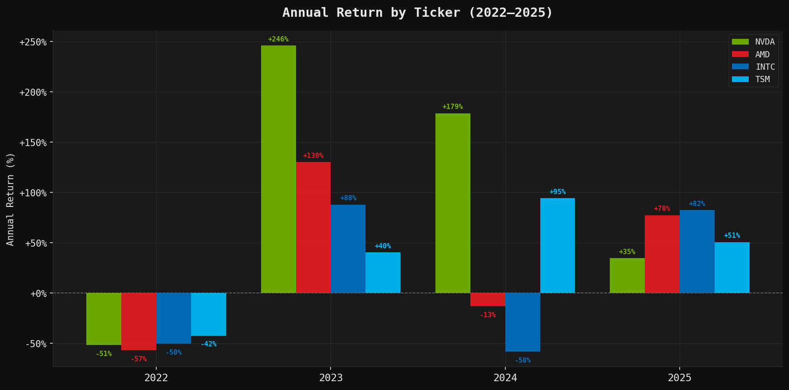
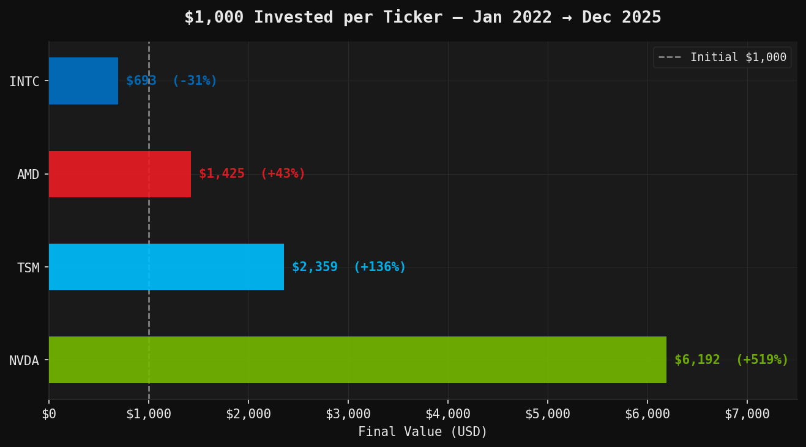
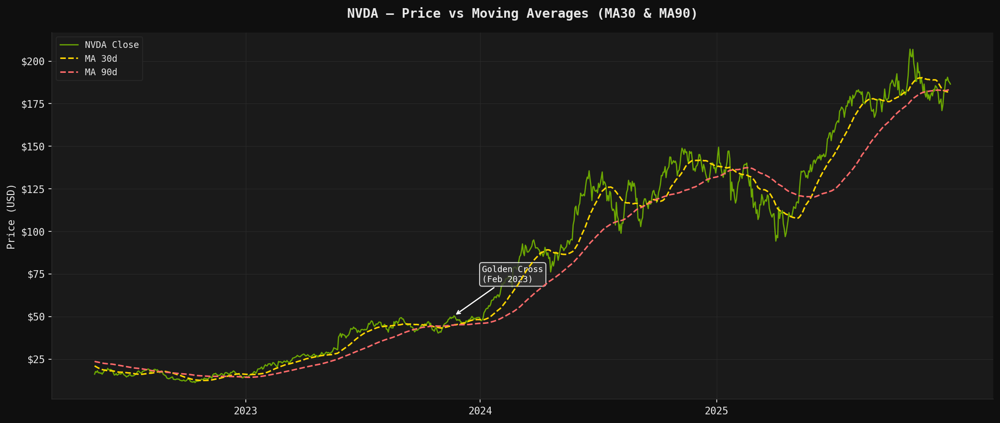
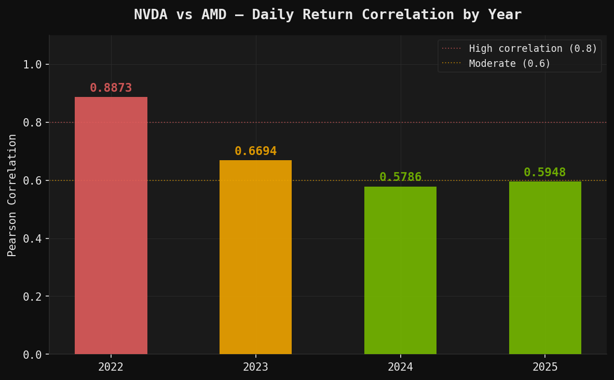

# Semiconductor Stock Analysis (2022–2025)
### SQL-first analytical project — Portfolio showcase

---

## Overview

This project analyzes 4 years of daily stock price data for four major semiconductor companies:
**NVDA** (Nvidia), **AMD**, **INTC** (Intel), and **TSM** (TSMC).

The analysis is written entirely in SQL, demonstrating window functions, CTEs, time-series logic,
and financial metrics — all computed without external libraries.

| | |
|---|---|
| **Period** | January 2022 – December 2025 |
| **Tickers** | NVDA, AMD, INTC, TSM |
| **Rows** | 4,012 trading days |
| **Tool** | SQLite (compatible with DuckDB / PostgreSQL) |

---

## Files

```
ai-chip-market-analysis/
├── data/
|   ├── stock_data_2022_2026.csv   ← Raw data
|   ├── create_db.py               ← One-time script: CSV → stocks.db
|   └── visualization.py           ← Generates charts with matplotlib
├── stock_analysis.sql         ← All queries (6 analyses)
├── images/
│   ├── chart1_annual_returns.png
│   ├── chart2_investment_sim.png
│   ├── chart3_nvda_moving_avg.png
│   └── chart4_correlation.png
└── README.md
```

---

## Setup

**Requirements:** Python 3 + matplotlib

```bash
# 1. Install dependencies
pip install matplotlib

# 2. Create the database
python create_db.py

# 3. Generate visualizations
python visualizations.py

# 4. Open stock_analysis.sql in VS Code
#    Connect SQLTools → SQLite → stocks.db
#    Run queries with Ctrl+E Ctrl+E
```

---

## Analyses & Key Findings

### 1. Annual Return by Ticker — with ranking
> *CTEs · FIRST_VALUE · LAST_VALUE · RANK() · Window functions*

2022 was a bloodbath for the entire sector — every ticker fell over 40%.
The real story begins in 2023, when NVDA exploded +246% driven by the generative AI demand surge.

| Year | Winner | Return | Loser | Return |
|------|-----------|--------|----------|--------|
| 2022 | TSM | -42% | AMD | -57% |
| 2023 | **NVDA** | **+246%** | TSM | +40% |
| 2024 | **NVDA** | **+179%** | INTC | -39% |
| 2025 | TSM | +16% | NVDA | +35%* |

---

### 2. Top 10 Most Volatile Days
> *ABS(), arithmetic expressions, CASE WHEN, ORDER BY computed column*

The single most volatile session in the entire dataset was **April 9, 2025** —
the day markets reacted to Trump's tariff pause announcement, sending all four
tickers up 13–22% in a single session.

The second cluster of volatility was **February 24, 2022** — the day Russia
invaded Ukraine, triggering sharp moves across semiconductor stocks.

---

### 3. Hypothetical $1,000 Investment (Jan 2022 → Dec 2025)
> *CTEs · JOIN · subqueries · CASE WHEN classification*

If you had invested $1,000 in each ticker at the start of 2022:

| Ticker | Initial Price | Final Price | Final Value | Total Return |
|--------|--------------|-------------|-------------|--------------|
| **NVDA** | $30.12 | $186.50 | **$6,192** | **+519%** |
| TSM | $128.80 | $303.89 | $2,359 | +136% |
| AMD | $150.24 | $214.16 | $1,425 | +43% |
| INTC | $53.21 | $36.90 | $693 | **-31%** |

NVDA turned $1,000 into $6,192. INTC was the only ticker to end in the red —
a casualty of losing market share to AMD and ARM in both CPUs and AI accelerators.

---

### 4. 30-Day & 90-Day Moving Averages — NVDA
> *AVG() OVER · ROWS BETWEEN · trend signal logic*

The MA30 crossed above the MA90 in **February 2023** — a classic "golden cross"
that preceded NVDA's historic rally. The signal stayed bullish for the rest of
2023 and through 2024.

```sql
-- Signal logic embedded in the query:
CASE
    WHEN ma_30d > ma_90d THEN 'BULLISH'
    ELSE 'BEARISH'
END AS signal
```

---

### 5. Best & Worst Quarter per Ticker
> *Quarter extraction in SQL · chained CTEs · multiple RANK() partitions*

| Ticker | Best Quarter | Return | Worst Quarter | Return |
|--------|-------------|--------|---------------|--------|
| NVDA | 2023-Q1 | **+94%** | 2022-Q2 | -43% |
| AMD | 2023-Q1 | +53% | 2022-Q2 | -29% |
| INTC | 2025-Q3 | +47% | 2024-Q2 | -30% |
| TSM | 2025-Q2 | +34% | 2022-Q2 | -20% |

Q2 2022 was the worst quarter for every ticker — peak inflation fears and Fed
rate hike expectations hit the sector simultaneously.

---

### 6. Pearson Correlation — NVDA vs AMD (daily returns)
> *LAG() · manual Pearson formula in SQL · no external libraries*

```sql
-- Pearson correlation computed entirely in SQL:
(AVG(ret_nvda * ret_amd) - AVG(ret_nvda) * AVG(ret_amd))
/ (SQRT(AVG(ret_nvda²) - AVG(ret_nvda)²) * SQRT(AVG(ret_amd²) - AVG(ret_amd)²))
```

| Year | Correlation |
|------|-------------|
| 2022 | 0.887 |
| 2023 | 0.669 |
| 2024 | 0.579 |
| 2025 | 0.595 |

High correlation in 2022 (macro selloff moved everything together).
Divergence in 2023–2024 reflects NVDA's unique positioning in AI vs AMD's
more CPU/gaming-heavy mix at the time.

---

## Visualizations

### Annual Return by Ticker (2022–2025)

Every ticker collapsed in 2022 amid rate hike fears and a broad macro selloff.
The inflection point came in 2023, when NVDA surged **+246%** fueled by generative AI demand —
while INTC continued losing ground through 2024, unable to keep up in CPUs or AI accelerators.



---

### $1,000 Invested in January 2022

A $1,000 bet on NVDA in early 2022 would be worth **$6,192 by end of 2025** (+519%).
TSM and AMD delivered modest but positive returns. INTC was the only ticker to finish
in the red (-31%), reflecting its structural decline in market share.



---

### NVDA Price vs Moving Averages (MA30 & MA90)

The **Golden Cross** in February 2023 — when the 30-day MA crossed above the 90-day MA —
signaled the start of NVDA's historic rally. The bullish signal held through all of 2023
and 2024, making it one of the most consequential trend signals in the dataset.



---

### NVDA vs AMD — Daily Return Correlation by Year

Both stocks moved almost in lockstep during 2022 (correlation: 0.89), driven by macro
factors hitting the whole sector equally. As NVDA pivoted into AI infrastructure and AMD
stayed closer to CPUs and gaming, correlation dropped steadily to 0.58 by 2024 —
a sign of genuine business divergence, not just market noise.



---

## SQL Techniques Demonstrated

| Technique | Used in |
|-----------|---------|
| Common Table Expressions (CTEs) | Queries 1, 3, 5, 6 |
| Window functions (`RANK`, `LAG`, `FIRST_VALUE`, `LAST_VALUE`) | Queries 1, 4, 6 |
| `ROWS BETWEEN` frame specification | Query 4 |
| Rolling averages (MA30, MA90) | Query 4 |
| Self-joins via CTE | Query 3, 6 |
| Conditional logic (`CASE WHEN`) | Queries 2, 3, 4 |
| Quarter extraction in pure SQL | Query 5 |
| Manual statistical formula (Pearson) | Query 6 |

---

## Data Source

Synthetic dataset generated for portfolio purposes, modeled after real OHLC
price structure for NVDA, AMD, INTC, and TSM over the 2022–2025 period.